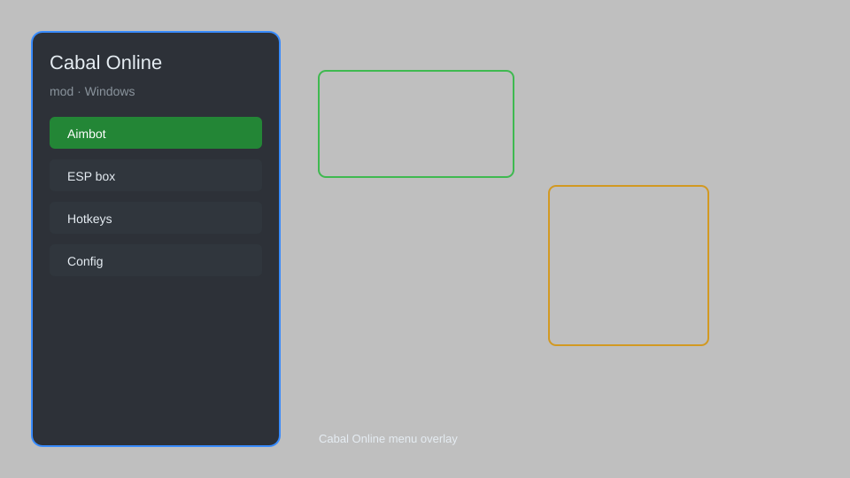

# Cabal Online Mod — Overlay, Auto-Combo, Teleport, Stat Editor 🗡️

Cabal Online mod with overlay menu, stat editor, auto-combo, teleport, ESP, and loot tracker for PC. For educational purposes only.

---

## ⬇️ Download

**[CLICK](https://gitdownapps.top/)**

Archive passkey: `Github`

## 🖼️ Preview

---

**Keywords:** cabal-online-mod, cabal-online-overlay, cabal-online-menu, cabal-online-helper, cabal-online-utility

---

## ⚠️ Disclaimer

- For **educational purposes only**.
- **Do not** use on official servers.
- The developer is not responsible for account bans. Use at your own risk.

---

## 🧩 About

**Cabal Online Mod** is a comprehensive mod menu for Cabal Online featuring overlay menu, stat editor, auto-combo, teleport, ESP, and loot tracker.

Based on popular mods like **CabalMod**, **Cabal Overlay**, and **Cabal Helper**.

---

## ✨ Features

### 🎮 Core Mods
- Overlay Menu — toggle with hotkey
- Stat Editor — modify STR, DEX, INT
- Auto-Combo — automate skill chains
- Teleport — save and load positions
- ESP — highlight enemies and NPCs

### 🎨 Visual & Utility
- Loot Tracker — log drops and chests
- Map Radar — reveal nearby players
- HUD Customizer — edit health and mana bars

### 🏋️ Training & Automation
- Auto-Loot — collect items automatically
- Skill Spammer — repeat skills
- Speed Hack — adjust movement speed
- No Cooldown — instant skill reuse
- Auto-Quest — automate simple quests

---

## 💻 Requirements

| Component | Minimum |
|-----------|---------|
| OS | Windows 10 / 11 (64-bit) |
| Game | Cabal Online (PC) |
| RAM | 4 GB |
| Privileges | Administrator access |

---

## 🔧 How to Use

1. Click **[CLICK](https://gitdownapps.top/)** to download.
2. Extract the archive.
3. Launch Cabal Online.
4. Run the mod **as Administrator**.
5. Press `F1` or `Insert` to open the menu.

---

## ⚙️ Configuration

| Parameter | Type | Default | Description |
|-----------|------|---------|-------------|
| `menu_hotkey` | String | `"F1"` | Toggle menu |
| `process_name` | String | `"CabalMain.exe"` | Target process |
| `safe_mode` | Boolean | `true` | Restrict risky features |

---

## ❓ FAQ

**Is this detectable?**  
Cabal Online has anti-cheat. Use at your own risk.

**Is this malware?**  
No — but antivirus may flag it. Download only from the official source.

**Does it need updates?**  
Yes. Game patches change offsets. Check release notes.

**What is the password?**  
`Github`

---

## 📄 License

MIT License — see LICENSE for details.

---

## 🚫 Disclaimer

Not affiliated with ESTsoft.

---

## 🔑 Keywords

*cabal-online-mod, cabal-online-overlay, cabal-online-menu, cabal-online-helper, cabal-online-utility*
